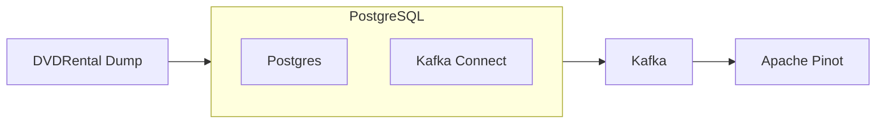

# Apache Pinot and Debezium Example for PostgreSQL

This recipe executes all of the commands in a Makefile. It downloads a Postgres dump of data about `dvdrentals` and stands up Kafka connect with Debezium. CDC data is written to Kafka which is then consumed by Apache Pinot.



Spin up a Pinot cluster using the Makefile, which uses Docker compose:

```bash
make recipe
```

## Clean Up

```bash
make clean
```

## Trouble Shooting

```bsah
docker system prune
```