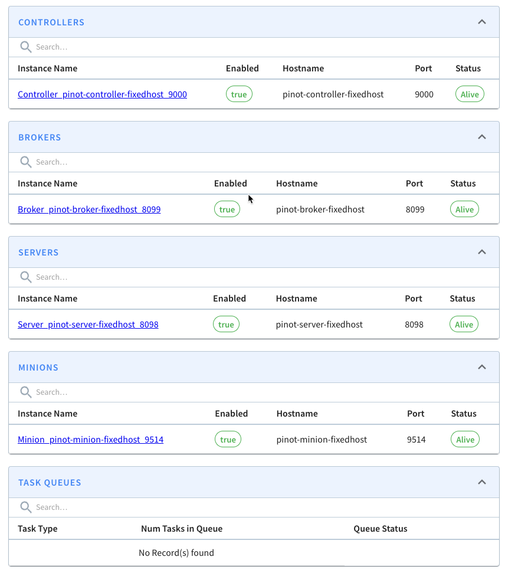

# Fixing the hostname

> In this recipe we'll learn how to fix the host name of Apache Pinot components


***

Clone this repository and navigate to this recipe:

```bash
git clone git@github.com:startreedata/pinot-recipes.git
cd pinot-recipes/recipes/fixed-hostname
```

Spin up a Pinot cluster using Docker Compose:

```bash
docker-compose up
```

Navigate to http://localhost:9000 and you should see that the host names are fixed.

