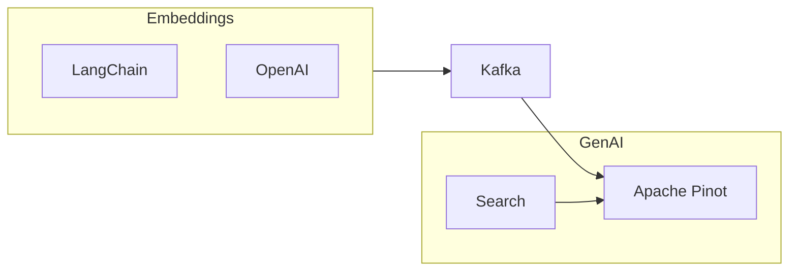

# Real-Time RAG Pinot

This repository is a Retrieval-Augmented Generation (RAG) example using Apache Pinot,  LangChain, and OpenAI. The use case is to load documentation and allow an LLM to answer questions provided by a user. This approach enables you to generate AI responses that are fresh and in real time. A diagram of the data flow is shown in the Mermaid diagram below.



This RAG example uses LangChain's `RecursiveUrlLoader`. It accepts a URL, recursively loads pages, and converts them into `documents`. These documents are converted into embeddings, submitted to a Kafka topic, and consumed by Apache Pinot.

## Docker

This repo builds the Apache Pinot project. You may get an error `No space left on device` when building the container. Execute the command below to free resources before building.

```bash
docker system prune --all --force
```

**NOTE:** Building the Pinot image will take about 25 minutes to finish

## Makefile

To start the example, run the command below.

```bash
make all
```

This will start Pinot and Kafka.

## Load Documentation

Run the command below to load Pinot with embeddings from your document site by providing a URL. The loader will recursively read the document site, generate embeddings, and write them into Pinot.

```bash
make loader URL=https://dev.startree.ai/docs
```

If you have a large document site, this loader will take longer. You will see confirmations on the screen as each embedding is sent to Kafka and Pinot.

This loader creates an embedding per page so that we can perform an UPSERT in Pinot. If you have larger pages and depending on the AI model you are using, you may get this error:

```
This model's maximum context length is 8192 tokens
```

Alternatively, you can chunk the pages into smaller sizes and UPSERT those records in Pinot by URL + ChunkId. The implementation in this repository does not do that.

## Ask Your Questions

Run the command below and ask a question that the documentation you loaded can answer.

```bash
make question
```