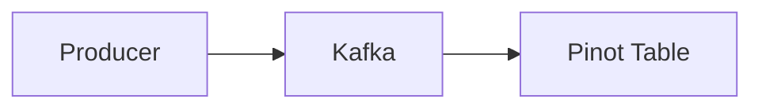
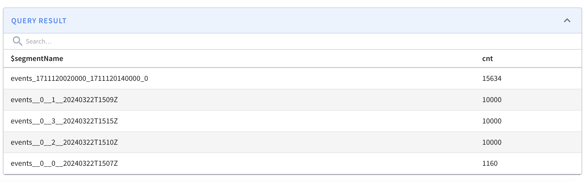
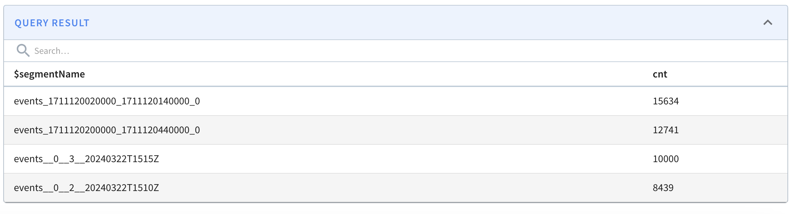

# Managed Offline Flow

Pinot is most commonly used to provide real-time analytics based on streaming data, which can be achieved using a real-time table. However, after running these systems for a while, we'll want to update the data ingested into this table. Perhaps the name of a value in a column has been updated, or we want to remove some duplicate records.

Segments in real-time tables can't be replaced, but we can replace those in offline tables. Managed offline flow is the way that Pinot handles the process of moving the data from real-time to offline tables.

> In this recipe we'll learn how to use Pinot offline managed flow.

|Property|Value|
|-|-|
|Pinot Version|0.9.3|
|Schema| [schema](config/schema.json)|
|Table Config| [Offline](config/table-offline.json)|
|Table Config| [Realtime](config/table-realtime.json)|

This is the code for the following recipe: https://dev.startree.ai/docs/pinot/recipes/real-time-offline-job

## Makefile



```bash
make recipe
```

Running this recipe will build the mermaid graph above and start producing data into Kafka.

Run the next Make task:

## Managed Offline Flow

```bash
make manage_offline_flow
```

The Make command above will perform these tasks:

- Sets the necessary properties in the Pinot Controller to enable the managed offline flow task: `RealtimeToOfflineSegmentsTask`.`timeoutMs` and `.numConcurrentTasksPerInstance`.
- Schedule the task to run.
- Prints logs related to the task.
- Updates the hybrid table's time boundary so that you can see records that have been move to offline.


## View realtime and offline segments

```sql
select $segmentName, count(*) cnt
from events
group by $segmentName
order by cnt desc
```

Run the statement above to see records migrate from REALTIME to OFFLINE by running `make realtime` to generate more data and `make manage_offline_flow` to migrate older data to OFFLINE. See a sample result below:

Before:



After:



