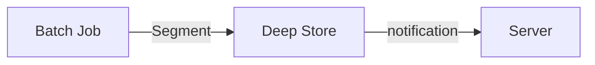

# Using MinIO as a Deep Store

In this recipe we'll learn how to use [MinIO](#what-is-minio) as a [Deep Store](#what-is-the-deep-store) for segments in real-time tables.


## What is the Deep Store?

The deep store is the permanent storage for segment files in Apache Pinot. It is used for backup and restore operations, where server nodes in a cluster can pull down a copy of segment files from the deep store if needed. The deep store stores compressed versions of segment files without indexes and can be stored on various file systems.

Servers need to recover segments from the deep store in scenarios where the local segment files on a server are damaged or accidentally deleted. Additionally, new server nodes in a cluster will pull down a copy of segment files from the deep store during backup and restore operations.

Pinot supports the following file systems: 
- Amazon S3
- Google Cloud Storage
- HDFS
- Azure Data Lake Storage.

## What is MinIO?

MinIO is a cloud storage server designed to be small, scalable, and optimized for large enterprise deployments. It can be installed on physical or virtual machines, launched as Docker containers, and deployed on container orchestration platforms like Kubernetes. MinIO provides features such as erasure coding, data protection, encryption, identity management, replication, global federation, and multi-cloud deployments.

The MinIO Client supports Amazon S3-compatible cloud storage services on Linux, Mac, and Windows platforms. The SDK offers an API to access any Amazon S3-compatible object storage server with language bindings available for various programming languages.

## How?

In real-time streaming use cases, a real-time Pinot table consumes from a stream from a streaming platform like Kafka or Pulsar and generates segments in memory. It is then uploaded to the lead controller (as part of the Segment Completion Protocol sequence), which writes the segment into the deep store.


The batch / offline approach is different. A batch job generates segments then uploads them into the deep store directly.



In both cases, the `Deep Store` is `MinIO`.


In this recipe, we use Docker to load an instance of MinIO and configure Pinot to use it to store segments and leverage Make to execute the commands.

Run the command below to build everything.

```bash
make recipe
```

**MinIO Configuration**

Below is the MinIO [configuration](../docker/minio.env). This is where we set the username and password to use in the Pinot controller and server.

```properties
# MINIO_ROOT_USER and MINIO_ROOT_PASSWORD sets the root account for the MinIO server.
# This user has unrestricted permissions to perform S3 and administrative API operations on any resource in the deployment.
# Omit to use the default values 'minioadmin:minioadmin'.
# MinIO recommends setting non-default values as a best practice, regardless of environment

MINIO_ROOT_USER=miniodeepstorage
MINIO_ROOT_PASSWORD=miniodeepstorage

# MINIO_VOLUMES sets the storage volume or path to use for the MinIO server.

MINIO_VOLUMES="/mnt/data"

# MINIO_OPTS sets any additional commandline options to pass to the MinIO server.
# For example, `--console-address :9001` sets the MinIO Console listen port
MINIO_OPTS="--console-address :9001"

# MINIO_SERVER_URL sets the hostname of the local machine for use with the MinIO Server
# MinIO assumes your network control plane can correctly resolve this hostname to the local machine

# Uncomment the following line and replace the value with the correct hostname for the local machine and port for the MinIO server (9000 by default).

MINIO_SERVER_URL="http://minio:9000"

```

**Controller Configuration:**

The Pinot controller is reconfigured to write segments to MinIO using the following configurations. Notice the factory class `S3PinotFS` uses an S3 client to interface with MinIO.

```properties
pinot.controller.storage.factory.class.s3=org.apache.pinot.plugin.filesystem.S3PinotFS
pinot.controller.storage.factory.s3.region=us-east-1
pinot.controller.storage.factory.s3.accessKey=miniodeepstorage
pinot.controller.storage.factory.s3.secretKey=miniodeepstorage
pinot.controller.storage.factory.s3.disableAcl=false
pinot.controller.storage.factory.s3.endpoint=http://minio:9000

```

**Server Configuration**

The Pinot server is also reconfigured to read segments from MinIO using the configuration below. Notice again the S3 references.

```properties
pinot.server.storage.factory.class.s3=org.apache.pinot.plugin.filesystem.S3PinotFS
pinot.server.storage.factory.s3.region=us-east-1
pinot.server.storage.factory.s3.accessKey=miniodeepstorage
pinot.server.storage.factory.s3.secretKey=miniodeepstorage
pinot.server.storage.factory.s3.disableAcl=false
pinot.server.storage.factory.s3.endpoint=http://minio:9000
pinot.server.segment.fetcher.protocols=file,http,s3
pinot.server.segment.fetcher.s3.class=org.apache.pinot.common.utils.fetcher.PinotFSSegmentFetcher

pinot.controller.storage.factory.s3.disableAcl=false

```

**MinIO Commands**

The Makefile does all the work after all the servers have started, but let's walk through what it's doing.

1. Get MinIO details from its log.

```bash
docker logs minio
```

Output:
```
Formatting 1st pool, 1 set(s), 1 drives per set.
WARNING: Host local has more than 0 drives of set. A host failure will result in data becoming unavailable.
MinIO Object Storage Server
Copyright: 2015-2024 MinIO, Inc.
License: GNU AGPLv3 - https://www.gnu.org/licenses/agpl-3.0.html
Version: RELEASE.2024-06-13T22-53-53Z (go1.22.4 linux/amd64)

API: http://minio:9000
WebUI: http://192.168.16.4:9001 http://127.0.0.1:9001

Docs: https://min.io/docs/minio/linux/index.html
Status:         1 Online, 0 Offline.
STARTUP WARNINGS:
- The standard parity is set to 0. This can lead to data loss.

 You are running an older version of MinIO released 2 weeks before the latest release
 Update: Run `mc admin update ALIAS`
```

2. Next we create an alias

```bash
docker exec -it minio mc alias set 'myminio' 'http://minio:9000' 'miniodeepstorage' 'miniodeepstorage'
```
Output:
```
mc: Configuration written to `/tmp/.mc/config.json`. Please update your access credentials.
mc: Successfully created `/tmp/.mc/share`.
mc: Initialized share uploads `/tmp/.mc/share/uploads.json` file.
mc: Initialized share downloads `/tmp/.mc/share/downloads.json` file.
Added `myminio` successfully.
```

3. Then, we use the `minio` CLI to verify that the alias works by looking up the information using the command below.

```bash
docker exec -it minio mc admin info myminio
```

Output:
```
●  minio:9000
   Uptime: 2 seconds
   Version: 2024-06-13T22:53:53Z
   Network: 1/1 OK
   Drives: 1/1 OK
   Pool: 1

┌──────┬───────────────────────┬─────────────────────┬──────────────┐
│ Pool │ Drives Usage          │ Erasure stripe size │ Erasure sets │
│ 1st  │ 78.4% (total: 55 GiB) │ 1                   │ 1            │
└──────┴───────────────────────┴─────────────────────┴──────────────┘

1 drive online, 0 drives offline, EC:0
```

4. Next, we create the bucket and list its contents using the following commands:
```bash
docker exec -it minio mc mb myminio/deepstore
```
Output:
```
Bucket created successfully `myminio/deepstore`.
```

5. Finally, we list the buckets in the alias we created. 
```bash
docker exec -it minio mc ls myminio
```
Output:
```
[2024-07-01 19:18:02 UTC]     0B deepstore/
```

## Validate

Check that minio has the segment in the deep store. You can also log into the minio console and check. http://localhost:9001/browser/deepstore. (username and password is `miniodeepstorage`)

```
docker exec minio mc ls myminio/deepstore/events
```

Next, delete a segment off a server and restart to recover from deep store.

```bash
# list all segments recursively
make list

# Delete all segments for the events table
make delete

# verify that segment is deleted
make list

# restart the server
make restart

# verify that segment is recovered, wait 10 seconds
make list
```