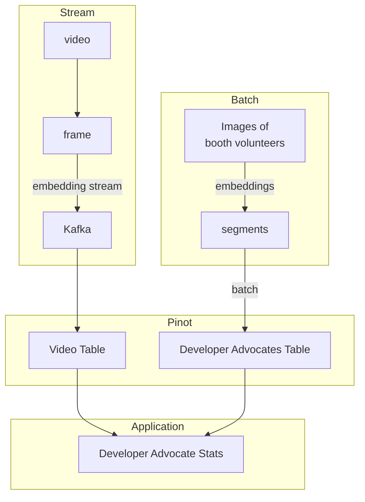

# Video AI



This example uses [Open Computer Vision]([https://](https://opencv.org/)) to capture video frames. These frames are sent through a [sentence transformer](https://sbert.net/) to convert the frame images into embeddings. We then use Pinot to search for people who were preloaded in the image video frames using Pinot's vector index.

The use case is called "Booth Duty," where an AI application supported by Apache Pinot analyzes the passing frames for people assigned to booth duty and measures each person's booth activities.

## Makefile

Run this command to build the infrastructure in docker.

```bash
make recipe
```

When this script finishes, run this Python script externally from docker. This is to allow for access to the web camera to capture videos.

```bash
python -m venv .venv # create python virtual environment
pip instal -r requirements.txt # install the modulas in the virtual environment

python video.py .8
```

Notice the `.8` argument passed. This is the threshold provided to the application to tune the algorithm. The quality of the image greatly affects the accuracy of the algorithm. The value should be between -1 to 1. The closer to 1, the more positively accurate the score. Lower scores will cause it to be more lenient. The better the camera and images captured, the closer you want to be 1, but not equal to 1.

Run this to view a Streamlit app showing the Dashboard.

```bash
make app
```

When done, run the command below to cleanup.

```bash
make clean
```